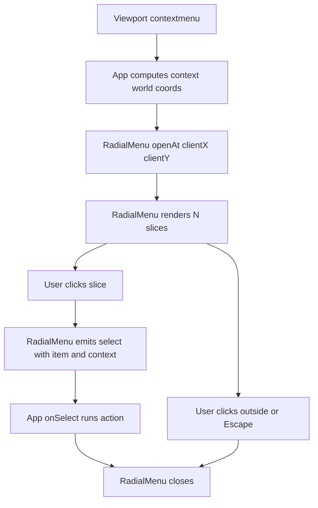

# Radial Right-Click Menu Modularization Plan (Reusable + Dynamic Segments)

## Current State (Baseline)

- The radial menu is currently **hard-coded to 4 options** in [`index.html:21`](../index.html:21) with static SVG `<path>` elements and ids like `addCircle`.
- Behavior is wired with **direct element references + per-slice click handlers** in [`js/main.js:79`](../js/main.js:79).
- Menu positioning/clamping assumes a fixed 200x200 size in [`js/main.js:95`](../js/main.js:95).

This makes it hard to reuse the menu elsewhere, and hard to change the number of options.

## Goals for V1 (confirmed)

- Single-ring donut radial context menu.
- Accepts any **N options** (N >= 1).
- Options are rendered as **equal angle segments** around the ring.
- **Text labels only** (no icons in v1).
- Close behaviors: click center hole, click outside, `Escape`.
- Reusable: can be attached to different targets or opened programmatically.

## Non-goals for V1 (explicitly deferred)

- Multi-ring menus, submenus, hover-to-expand.
- Icons.
- Full keyboard navigation (arrow-key selection). (We can still do basic ARIA and `Escape`.)
- Radial animation system.

## Proposed Module Boundary

Create a reusable UI component that owns:

- DOM creation for the menu container + SVG
- Geometry computation for donut slices
- Menu state (open/closed)
- Event binding for selection + dismissal
- Rendering from a data model (items array)

Keep application-specific actions (add circle/rect/etc.) outside the component.

### Recommended file layout (vanilla JS, no build tooling)

- [`js/ui/RadialMenu.js`](../js/ui/RadialMenu.js)
- [`js/ui/radialMenuGeometry.js`](../js/ui/radialMenuGeometry.js)
- [`css/radial-menu.css`](../css/radial-menu.css)

Notes:

- Because the project currently loads [`js/main.js:1`](../js/main.js:1) via a non-module `<script>` tag in [`index.html:39`](../index.html:39), we have two viable implementation approaches:
  1. Convert to ES modules (`<script type=module>`) and use `import`.
  2. Keep everything global and expose `window.RadialMenu`.

This plan assumes approach (1) for clean modularity, but it can be implemented either way.

## Public API Proposal (Reusable Component)

### Data model

```js
// RadialMenuItem
{
  id: 'addCircle',
  label: 'Circle',
  onSelect: (ctx) => {},
  enabled: true
}
```

### Constructor and core methods

```js
const menu = new RadialMenu({
  outerRadius: 100,
  innerRadius: 50,
  // Where to attach the menu overlay
  container: document.body,
  // Optional: used to clamp positioning
  viewportElement: document.documentElement
});

menu.setItems(items);
menu.openAt({ clientX, clientY, context: { /* arbitrary */ } });
menu.close();
menu.destroy();
```

### Events (optional but recommended)

- `menu.addEventListener('select', e => ...)` where `e.detail = { item, context }`
- `open` and `close` events for telemetry/debugging

Rationale: callbacks are easy for the app layer, events improve composability.

## Rendering Strategy

### 1) DOM owned by component

The component creates (or reuses) this structure:

- A root `<div class=radial-menu>`
- A child `<svg>` sized to `diameter = outerRadius * 2`
- Per-item `<path class=radial-menu__slice data-id=...>`
- Per-item `<text class=radial-menu__label>`
- A center `<circle class=radial-menu__hole>` that closes the menu

This removes the need for hard-coded markup in [`index.html:21`](../index.html:21).

### 2) Geometry: equally divided donut segments

Given:

- `N = items.length`
- `step = 2π / N`
- `startAngle = -π/2` (puts first segment centered at top)

For item `i`:

- `a0 = startAngle + i * step`
- `a1 = a0 + step`
- Outer arc points: `p0 = polar(cx, cy, rOuter, a0)`, `p1 = polar(cx, cy, rOuter, a1)`
- Inner arc points: `p2 = polar(cx, cy, rInner, a1)`, `p3 = polar(cx, cy, rInner, a0)`

SVG path (clockwise outer arc, counterclockwise inner arc):

```text
M p0
A rOuter rOuter 0 largeArc 1 p1
L p2
A rInner rInner 0 largeArc 0 p3
Z
```

Where:

- `largeArc = step > π ? 1 : 0`
- `cx = rOuter`, `cy = rOuter` (center of the viewBox)

This yields equal segments automatically for any N.

### 3) Labels

Label placement per segment:

- `am = (a0 + a1) / 2`
- `rm = (rOuter + rInner) / 2`
- `labelPos = polar(cx, cy, rm, am)`

Set:

- `text-anchor = middle`
- `dominant-baseline = middle`

Keep `pointer-events: none` (already present in [`css/styles.css:73`](../css/styles.css:73)) so clicks go to the slice.

### 4) Styling

Extract menu styles from [`css/styles.css:23`](../css/styles.css:23) into a dedicated stylesheet.

Color assignment options for v1:

- Simple palette cycling by index.
- Optional `item.color` override.

## Interaction Model

### Open triggers

The component should not “own” the `contextmenu` binding by default; instead, the app layer decides.

However, provide a helper if desired:

```js
menu.bindToContextMenu(targetEl, { getContext });
```

Where `getContext(event)` returns data like world coordinates from [`js/main.js:112`](../js/main.js:112).

### Closing behavior

- Close on outside click: document-level `pointerdown` while open.
- Close on `Escape`: document-level `keydown` while open.
- Close on center hole click.

Important integration detail:

- Stop propagation for pointer events inside menu so it does not trigger viewport panning logic in [`js/main.js:53`](../js/main.js:53).

### Selection

- Each slice click calls its item `onSelect(context)` then closes.
- If `item.enabled === false`, render disabled style and ignore clicks.

## Positioning + Viewport Clamping

Generalize [`js/main.js:95`](../js/main.js:95):

- `diameter = outerRadius * 2`
- `desiredLeft = clientX - outerRadius`
- `desiredTop = clientY - outerRadius`

Clamp against viewport bounds:

- If clamping relative to window: use `window.innerWidth/innerHeight`.
- If clamping relative to an element: use `element.getBoundingClientRect()`.

Result: menu can be used in side panels, mini-maps, or other sub-viewports.

## Integration Plan (How main.js will use it)

Replace hard-coded element references and per-slice listeners in [`js/main.js:12`](../js/main.js:12) and [`js/main.js:209`](../js/main.js:209) with:

- Define an items array:
  - `Circle`, `Rect`, `Line`, `Text`
- In `contextmenu` handler:
  - compute world coords using [`js/main.js:112`](../js/main.js:112)
  - call `menu.openAt({ clientX, clientY, context: { worldX, worldY } })`

Each item’s `onSelect` calls existing functions like `addCircleAt` in [`js/main.js:130`](../js/main.js:130).

## Mermaid: Interaction Flow



## Acceptance Criteria

- Menu renders correctly for N = 1, 2, 3, 4, 6, 8 options.
- Each slice covers equal angle portion of ring.
- Labels appear centered in each segment.
- Menu clamps to viewport and never goes off-screen.
- Clicking inside menu does not pan/zoom the viewport.
- Clicking outside, center hole, or pressing `Escape` closes.
- Menu can be instantiated and used from a different target element with a different items list.

## Implementation Notes / Gotchas

- SVG arc sweep flags are easy to get wrong; validate with a quick debug mode that draws small points at `p0..p3`.
- When N is large, labels will overlap; for v1 we accept this, but later we can:
  - hide labels under a minimum arc size
  - or wrap labels radially
- Use `pointerdown` instead of `click` if you want earlier capture and less interference with drag behaviors.

